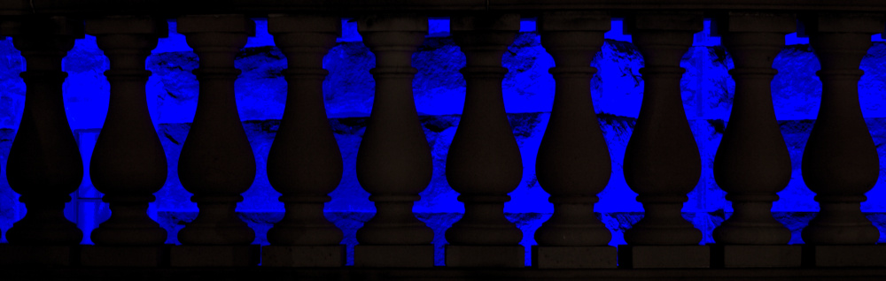
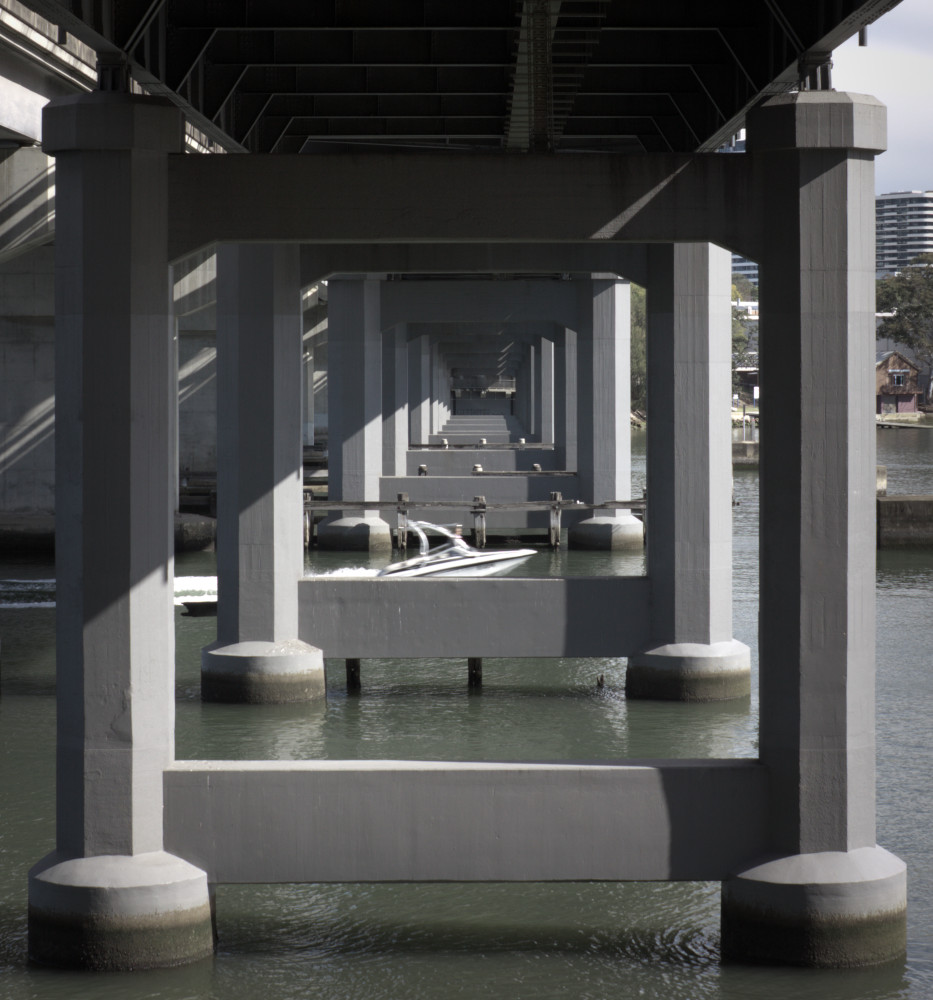
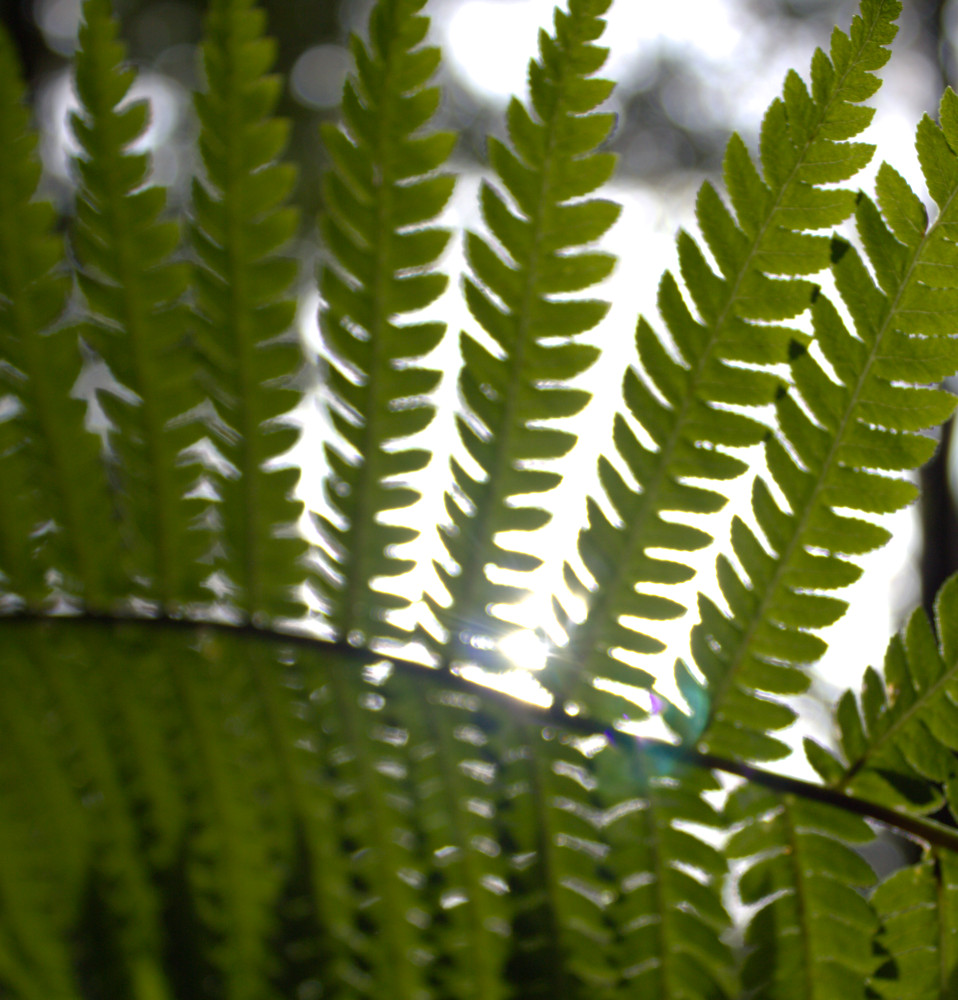
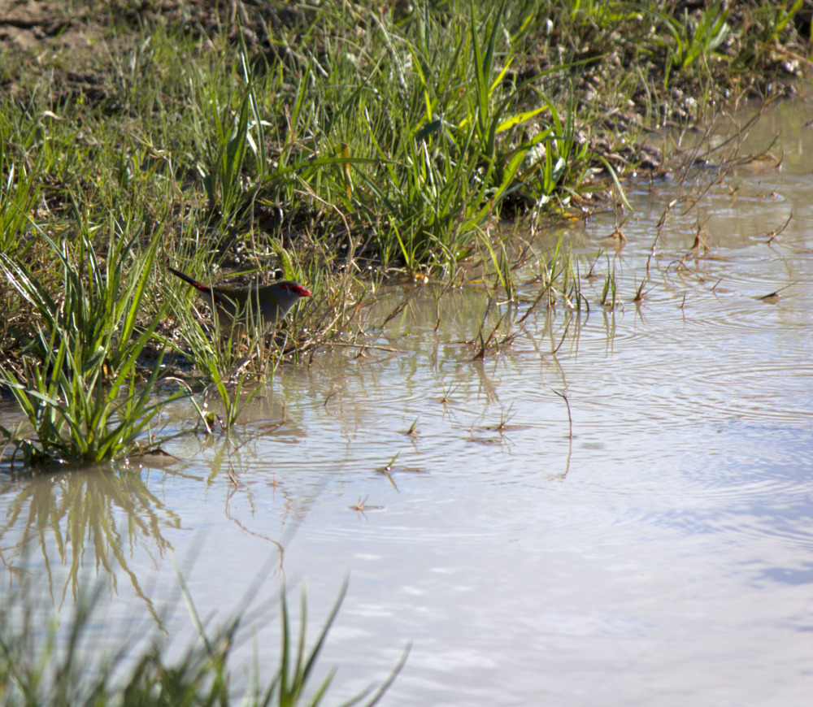
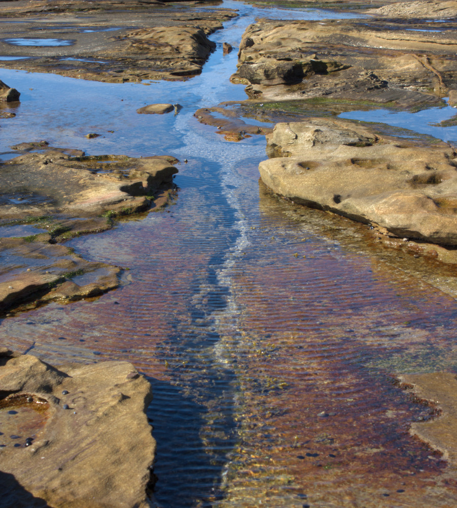
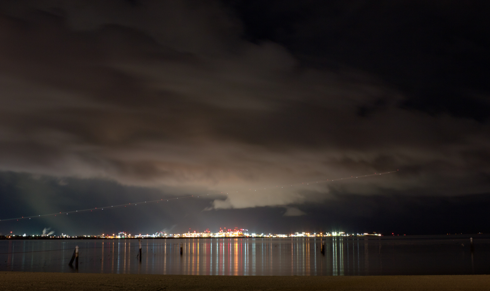

## Introduction

**About six months ago, I began a journey with photography**. With absolutely zero photography knowledge, I read a web article on the very basics of digital cameras, bought a second hand entry-level DSLR (with kit lenses) and started taking photos.  
Since then, photography has evolved into my primary hobby. My shots largely consist of near-to-mid ranges of plants, animals, and urban structures; long exposure night shots; some macros of miscellaneous subjects; and a few portraits. To date I've taken ~1500 shots, resulting in over 100 finished images which I felt were good enough to show others.

Apart from that first web article, the majority of my understanding of the photographic process has some from good old trial and error, or my own research - for better, or for worse. This page is a collection of some of the bits of knowledge I've learnt and which have helped me improve as a photographer.

Disclaimer: naturally, some of the knowledge is specific to my camera and the shots I like to take. By no means is this information meant to be authoritative. It's just my personal experience :)

## On Visual Perception

**The human visual system** is amazing! The dynamic range imaging technology (or at least low/mid range technology) can capture pales in comparison to what we see. Even "normal" everyday daylight scenes can present an uncomfortably large range of brightnesses for cameras. Meanwhile, cameras struggle to gain high enough exposure in shady and night shots without very high ISO or exposure time. Dynamic range is one of the most important factors I consider when scoping out the feasibility of a shot.

**Relative brightness** plays a large role in making an image that looks realistic - possibly more important than absolute brightness. Insufficient contrast between regions will create a washed, underwhelming image that lacks focus/direction. Too much contrast makes images look more artificial. Also, contrast which doesn't follow what the brain infers based on the environment can look odd.

**Clipping** is not necessarily the enemy. Clipping is failure to represent a brightness level digitally, and so naturally at first I thought it was terrible and to be avoided at all costs. Yet many shots cannot be captured without some clipping, and clipping of very bright objects - such as the sun, overhead lights, and harsh reflections - is alright, because we see them as basically clipped in real life anyway. (We are worse at perceiving brightness changes in high brightness, as opposed to low brightness).  
Clipping only becomes an issue if large regions are clipped, which results in noticeable degradation of colour information, or if clipping creates harsh contrast.

**Framing** can make or break a shot. Finding a framing that works can be surprisingly difficult, because in real life you see all the surrounding context, but in a photo the perceived world is constrained to a rectangle. Objects (or the lack of objects) near the edge of the frame can have a significant impact on the overall feel and cohesion of the image.

*This shot would not be as effective without the primary palette of dark/midtone/light greys and the square framing. Unfortunately it could be even more effective if there were fewer distracting objects near the edges of the frame.*

## On Optics

**Depth of field** scales linearly with aperture but quadratically with distance. Unless you need perfect focus between very close and further-away objects, you can get away with pretty large aperture. I rarely need narrow apertures like f/14+.

**Chromatic aberration** is a real problem, at least on my lenses. This is an optical artefact where different colours are focused slightly differently, resulting in coloured fringes. I find it gets worse with bright white light. It's theoretically worse with higher aperture, yet even with apertures around f/10 it's bad on my lenses. Chromatic aberration correction algorithms exist but are imperfect.

**Lens filters** slightly reduce exposure and can cause additional lens flares. The flares are particularly noticeable and unpleasant in dark shots with bright lights. During the day I leave the filters on for physical protection of the lens, but at night I try to shoot without them.

*You can see the diffraction, chromatic aberration, and possibly a lens filter flare in this close-up of a fern occluding direct sunlight.*

## On Colour Reproduction

**Colour temperature** - the balance of yellow/blue and red/green - is very important: using the wrong temperature makes all colours look off. And you may not be able to rely on the camera to decide the best temperature in all scenarios. On my camera, green seems to be overcompensated, resulting in photos with a lot of greens looking lack-lustre. I usually manually pick, informed by a combination of camera-decided, editor automatic algorithms, and editor presets.

**Skin tones** can be tricky to get correct, because there are a variety of colours which could plausibly fit someone's skin. Paler skin tones reflect the surrounding lighting, adding to the difficulty. Not to mention that skin itself changes constantly. Editing someone's skin tones is quite personal to me - you have to really know the person and the moment in which the shot was taken.

*Balancing the colour temperature in this photo is important to evoke an image of a living, mini oasis, as opposed to a brown, muddy puddle.*

## On Image Storage & Display

**Different displays** on different devices vary *wildly* in their colour output. My laptop screen is terrible, with low contrast and poor colour coverage. My phone defaults to some magic colour profile which isn't flat, and the contrast is mediocre. My laptop's external monitor is pretty good - too good really, compared to the other devices.  
Editing often feels like a battle to optimise the average viewing experience across many devices. Who knows, maybe my calibration is wrong and my photos look strange on your screens? (Which is somewhat anxiety-provoking.)  
Oh yeah, and don't edit with a blue light filter on: it may be good for your body, but messes up all colour.

**Instagram's** compression seems to use chroma subsampling, whereby colour information is stored at a lower resolution than brightness information. Such compression saves storage space, but cripples the quality of low-light photos.

**Filling out the dynamic range** available in image storage formats becomes important due to the above two points. If a photo is underexposed, it will look terrible on low-contrast screens (e.g. my phone). Furthermore, images generally look more pleasing to me when they exhibit as much dynamic range as possible.

*Adjusting the black level, contrast, and saturation transforms this rockpool into what could be a sweeping floodplain landscape.*

## On Camera Functions

**Flash is surprisingly good** at raising exposure of shadows/darks at near-to-mid ranges. Even if it's not visible to the eye at the time, it makes a difference to the photo. Using a low flash to provide ambient illumination for darker scenes can produce more pleasing lighting.

**Flash disproportionally affects** more reflective surfaces. It's quite easy to get too much contrast between these surfaces and other objects.

**The camera's light metering** does not necessarily give you the exposure you want. The standard mode gives all parts of the image equal weighting, which biases the exposure towards the average brightness. However, if the shot's focus is particularly dark/bright compared to everything else, then its exposure will probably be wrong.

**Autofocus** does not necessarily give the focus you want. I'm not sure the algorithm used to determine which autofocus points should be in focus, but it's sometimes not which points you want.

**Automatic controls** on the camera are tools to solve specific technical problems. These tools may or may not help with achieving your creative goals, as noted in the previous two points. Often I find it useful to disable some automatic camera facilities and manage controls myself to get the exact result I imagine. When it becomes exceedingly difficult to achieve a result manually (e.g. focus on a fast moving subject), I will enable automatic controls as appropriate.

*This rather challenging night shot was taken with manual exposure to capture the wide range of brightness levels in the way I envisioned.*

## Endnote

Thank you for sharing in the photography knowledge I've learnt over the past six months! It has been quite a journey.

The photos interspersed through this article are all ones by me. If you'd like to see more of my photos, you are welcome (but not at all obliged!) to take a look at my Instagram, [@records_by_reece](https://www.instagram.com/records_by_reece/).
