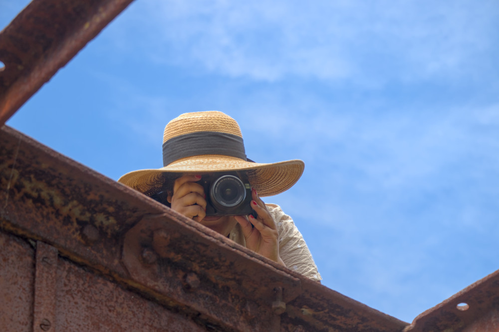
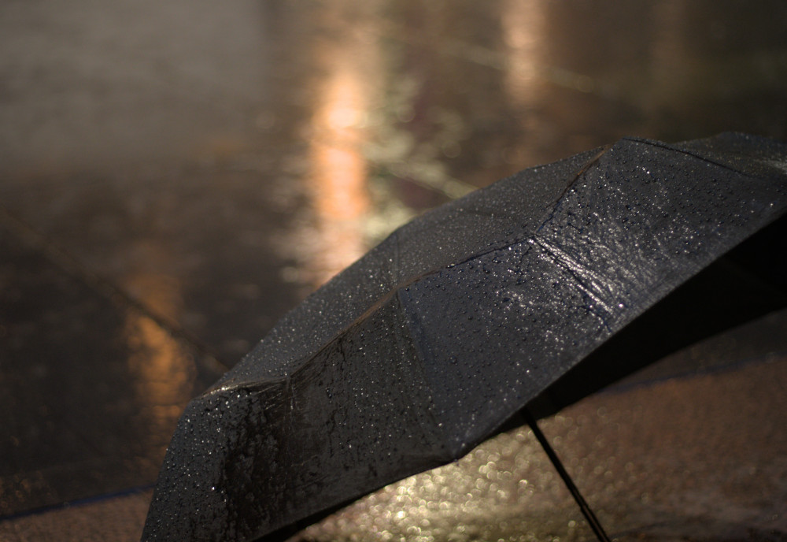
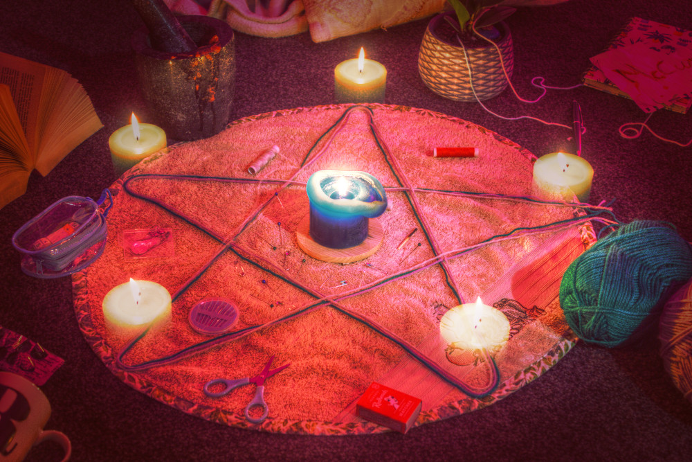
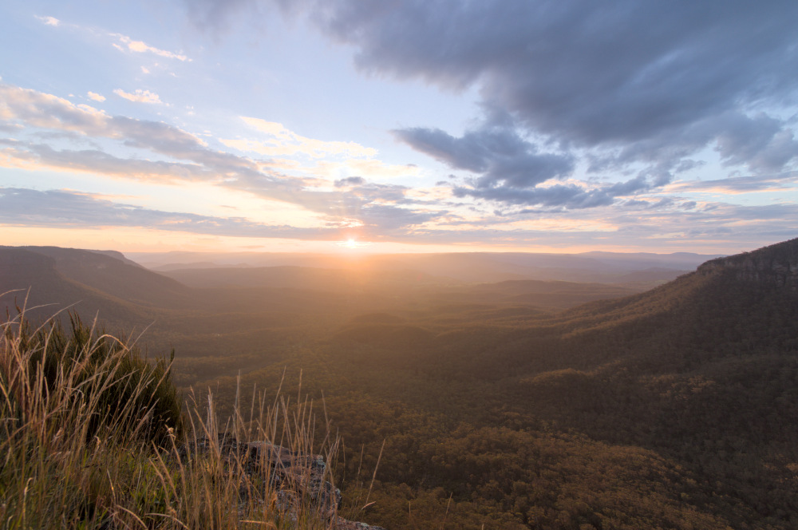
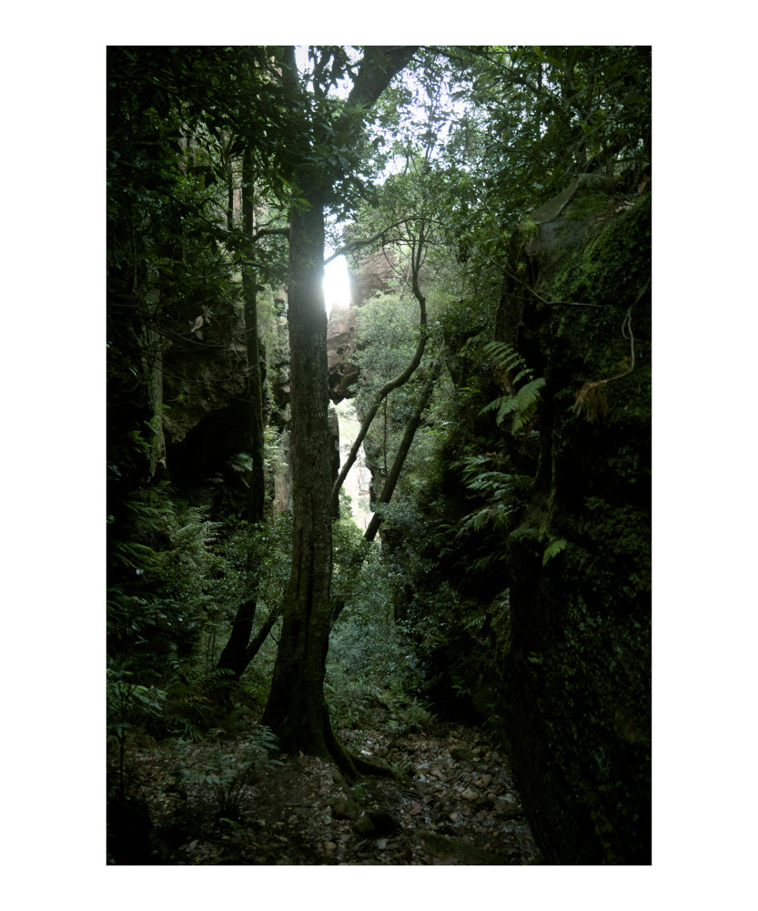
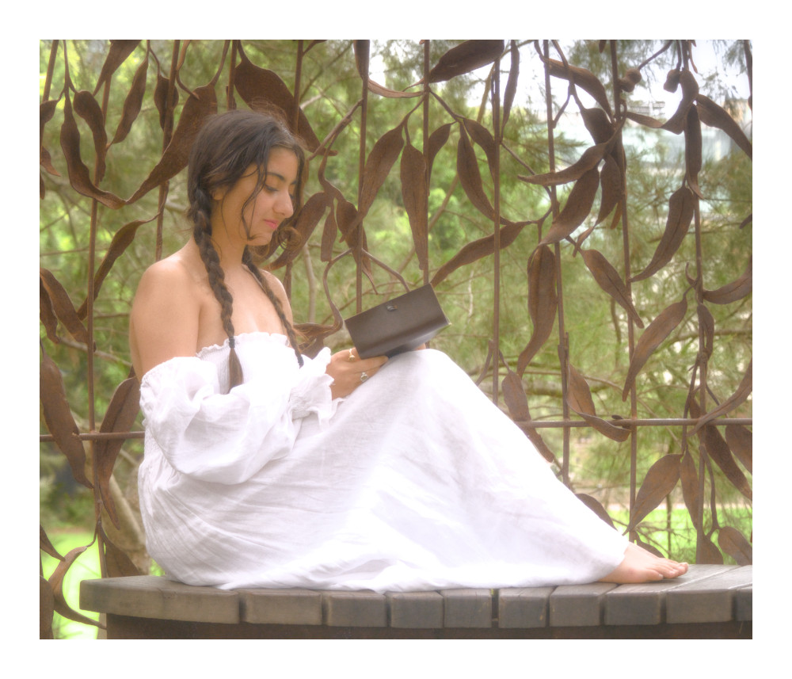

## Introduction

**About six months ago, I posted my learnings starting photography as a hobby.** Now, many hundreds of shots down the track, it's time to reflect again on what this adventure has taught me.

What's changed since last time? My camera of choice is slightly better (in the next model range up) and is supported by more lenses and more capable editing software. But the most significant change has been internal. I've gotten used to the technical aspects of using a camera, and my focus has been much more on artistic expression through composition, lighting, and colour. You could say that I've "levelled up" from just being able to capture a shot, to crafting a creative vision for a photo.

Disclaimer: this article is likely more opinionated than the last, given that I have become more opinionated about what photos I do and don't like. But by no means is this information meant to be authoritative :)

## Camera In Hand

**A great photo starts the first time you look at it.** When you see the scene, when you look through the viewfinder, when you review the shot afterwards - you will immediately know the image is destined for glory, even without any editing. These are the shots I chase.

The reason is that many aspects of a great shot are best or exclusively determined at the time of pressing the shutter button. Composition and lighting can't easily be fixed in editing (well, maybe unless you're into CGI). Even when correction is possible, it likely comes at a loss of image quality or realism. Therefore, the ability of the camera to capture a scene needs to be fully utilised to extract what you want from a scene with maximum fidelity. Where I might have spent hours trying to edit a poor photo previously, I now know the true solution is to *take a great photo to start with*.

**First and foremost, composition must be correct in camera.** Weak composition will nearly always produce an underwhelming result, no matter how great the content of the scene is. If you are not a CGI wizard, this means the original scene needs to be composed well.

One characteristic of composition I have noticed is that the relationship between scene complexity and visual quality tends to follow a U-shaped curve. Shots with few objects in them have a simple and clear story to the scene, which is pleasing. The opposite, with so many objects they haze into more of a texture, is effective too. In the middle, though, shots can get lost in a no-man's-land of composition, lacking direction and focus.

Relating to composition is framing, which can trivially be changed after the fact via cropping. However, when doing so, pixels are being thrown away which could otherwise contribute to the image. To maximise image quality, the desired framing should be captured in the camera.

*Simple yet strong composition and framing is all that was required to make this in-the-moment shot surprisingly effective.*

**Lighting must also be right when you press the shutter.** Although harbouring some flexibility to edit, I find that great lighting is best when naturally created. Editing can change brightness, contrast, and colour, yet the coherence of a scene is at its peak as seen in the real world. Reflections and shadows are particularly difficult to modify properly. Attempting to deviate too far from what the physics of the scene logically imply results in unnatural-looking images.

Cloudy skies and sunset[^1] are excellent times to take photos due to pleasing natural lighting. The ambient lighting is softer, with less contrast which might span a dynamic range too large to comfortably capture on a digital camera. In a country like Australia, where I live, this is particularly helpful to know, as the weather is commonly quite sunny. (Incidentally, sunny weather is also plausibly bad for image quality due to heating of the lens and sensor.) I have taken many landscape shots which look oddly unpleasant, and the cause is glaring brightness and hard shadows of the Australian mid-day.

Additionally, around sunset the colouring of sunlight changes, which produces lovely photos. Towards sunset, as the sunlight travels through more atmosphere, blue light is increasingly scattered, leaving the direct sunlight redder. After sunset, when all direct sunlight is gone, the ambient light is deeply blue.

An aspect of film I have come to admire, in terms of getting lighting correct in-camera, is its soft clipping. Digital sensors clip hard, meaning that captured luminances increase roughly linearly until the point of overexposure, at which they immediately become clipped and lose colour information. On the other hand, film tends to ease into overexposed areas, losing colour sublinearly as luminance increases. The resulting image has a generally more pleasing transition into highlight regions, compared to digital.

[^1]: Similar lighting conditions occur at sunrise, which I may get to experience if I ever become a morning person.

*Another quite simple image, brought to life by gorgeous lighting interactions between the street lamps and rain. The shallow depth of field adds subtle and pleasing complexity via the resulting bokeh.*

**Carry equipment which is useful.** There is a lot of exciting camera equipment out there - and you don't need most of it most of the time. I used to carry multiple lenses and a tripod around all the time, until the realisation came that often they went unused. Now, I try to think ahead on what shots I might be going for on an outing, and what equipment supports those goals.

- Tripod? Mostly useful for nighttime.
- Fast prime lens? Only need it for big depth of field or extreme low light shots.
- Super long zoom lens? Am I going to be shooting anything small from far away?
- Ultra-wide lens? For when I want crazy panorama-like landscapes.
- Spare battery? Haven't needed this one yet...

Of course, in extended, more dynamic scenarios, like holidays, there's nothing wrong with taking more equipment if you can pack it in.

**Consider constructing the scene you envision.** As in, physically building the scene. This will give you full control over the content of the image, the composition, and the lighting, and is the ultimate power move to create exactly the image you want. Obvious in retrospect, it took me a long time to notice that I was only photographing existing natural scenes, and I had the artistic desire - and ability - to craft the scene from scratch. I have done this in full once, and it was superbly fun and rewarding, although quite time-consuming. Perhaps in an alternate timeline, my calling is movie production.

*"Grandma's Halloween", inspired by a ball of yarn and a pentagram.*

## The Editing Bay

A great shot has the potential to be enhanced further with editing which leans into a particular look or style. Over the past months, I have become better at expressing a desired creative vision via edits. I have switched to a more capable editing software, through which my understanding of the technical aspects has improved.

**Editing starts and ends with colour spaces.** Colour spaces are wild: there's a whole world of maths in between what the camera captures and what is shown on a screen, even with no edits applied yet. In camera, the sensor captures a signal which changes linearly with the amount of incident light - this is called a "linear" or sometimes "high dynamic range" colour space. On the other hand, us humans do not perceive changes in brightness linearly, so consumer image storage and display formats use a "nonlinear" colour space. Further, most current display technology cannot reproduce the huge dynamic range present in the real world and captured by the camera.[^2]

An important part of the editing process is the conversion between the linear and nonlinear colour spaces, in an operation called tone mapping. A good editing software will do most editing in the linear colour space for maximum realism (known as "scene referred workflow"), and finally apply a tone mapping operator to produce a result which looks good on a screen or print. There is considerable flexibility in the tone mapping process. A tone mapping I often use is designed to emulate film, which has good contrast in midtones and compresses shadows and highlights. Such an operator produces a pleasing, soft look. Other tone mappings include local operators, which adjust contrast between different regions of the image (commonly known as "HDR", which is a bit of a misnomer).

[^2]: My explanation of colour spaces and tone mapping is greatly simplified, as my understanding is basic. In reality there is a lot more nuance to the science surrounding colour.

*Sunset over the mountains, a scene with extremely large dynamic range. Actually three images at different exposures, then combined and tone mapped to enable it to be displayed similarly to its in-person appearance.*

**Photo borders are not just for show.** For a long time I saw other photographers frame their images posted online with white borders and refused to do the same - after all, why should precious resolution be sacrificed? Then I tried it and immediately noticed how it can elevate an image's presence. I believe a border gives the viewer more focus on the scene. Firstly, the blank space separates the image physically from distractors around it, cementing it as a distinct and separate entity in the viewer's mind. Secondly, the white provides a reference which the brain understands as the brightest tone, and which all other tones are relative to. This seems particularly important on digital displays, whose brightness output differs significantly from luminances in the real world.

**Colour grading brings images to a new level of artistry.** We can play around with image brightness, why should we not do the same with colour? Colour grading is the process of adjusting colour-related parameters to achieve a desired look. These parameters include:

- Colour temperature;
- Global hue;
- Global saturation/chroma;
- Hue in shadows, midtones, and highlights;
- Saturation/chroma in shadows, midtones, and highlights.

In general, colour grading can apply an arbitrary transformation of hue, saturation, and brightness, unlocking a huge range of artistic effects. One popular technique is called a colour look-up table (LUT), a premade colour grading specification designed to emulate, for example, a specific film.  
You can go far exploring the possibilities of colour, and I have much to learn.

*The green-yellow tint, crushed shadows, and desaturated highlights in this forest shot evoke an eerie, horror-movie-like feeling.*

**Don't be afraid to be aggressive.** Often during editing I will notice an image looks... dull... even if the composition and lighting is good. Often the reason was my editing was not aggressive enough - it did not take enough advantage of the available medium. Culprits include:

- Exposure too low;
- Saturation too low (chroma can be a substitute to avoid the horrible oversaturated look);
- Contrast too low, or too high;
- Shadows not dark enough;
- Highlights not bright enough;
- Colour grading not strong enough;
- Exposure still too low.

If you are aiming for a strong, statement work of art, go crazy with your edits! Looking around at the photos that make you think "that's stunning!", how many of them are underexposed, flat, weak? For me, the answer is almost none.[^3] Great art has a vision and pushes it to its limits.

[^3]: This is not to say that stylistic choices with less visual presence, e.g. a faded look, are bad. It all depends on the vision you are going for. My point is that the stylistic choices should not be half-assed.

*In this edit, I was inspired by the colour grading and lighting effects of Rivendell from The Lord of the Rings films. Does it achieve great art? Maybe, maybe not, but at least I had a vision and chased it as best I could.*

## Final Words

Thank you once again for joining me in this photography journey. It's brought me from barely composing a scene, to pushing a creative idea from start to finish - learning about physics, technology, and art along the way.  
Seeing how far it has taken me in one year, I can't wait to find out where it leads me in the future.

------------------

The photos interspersed through this article are all by me. If you'd like to see more of my photos, you are welcome (but not at all obliged!) to take a look at my Instagram, [@records_by_reece](https://www.instagram.com/records_by_reece/).

## Footnotes
