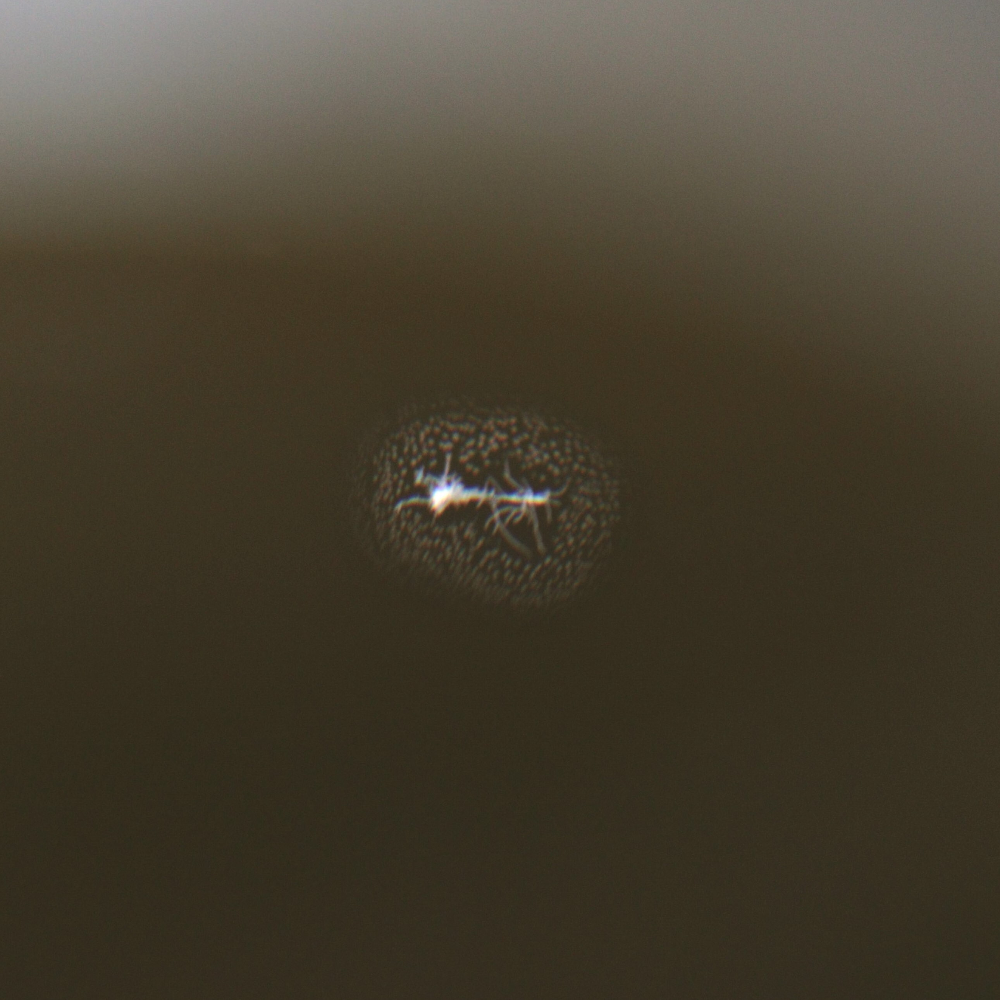
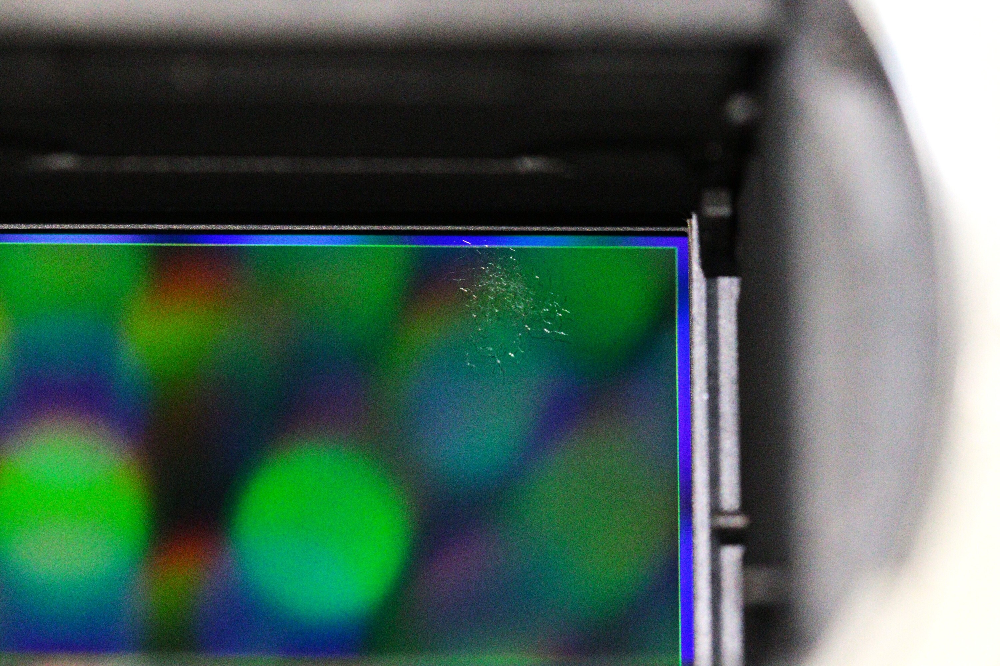
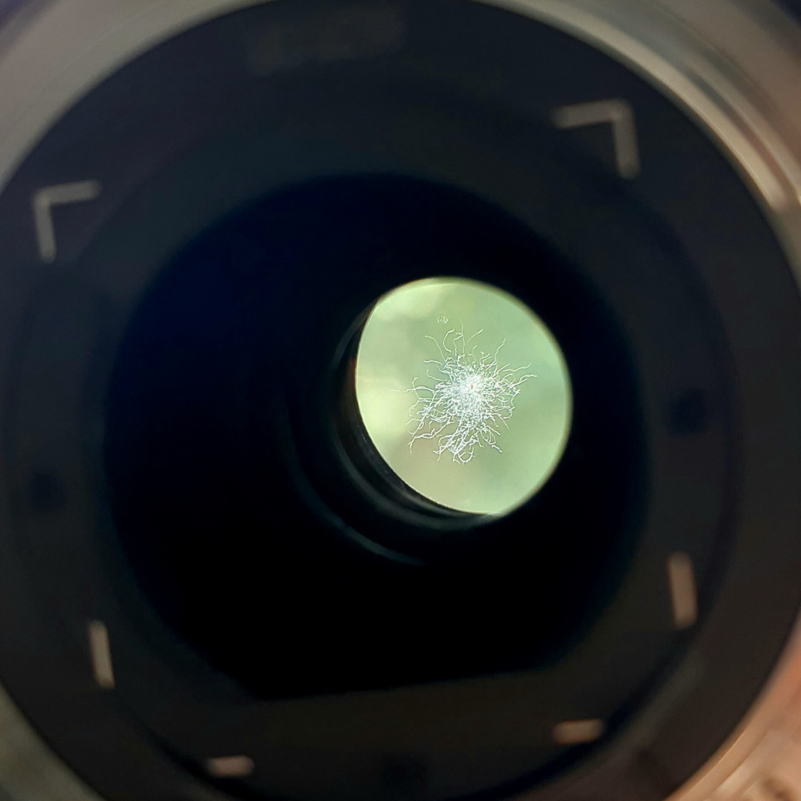
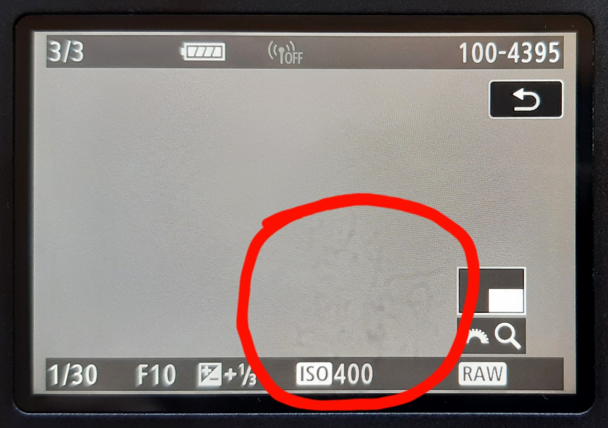
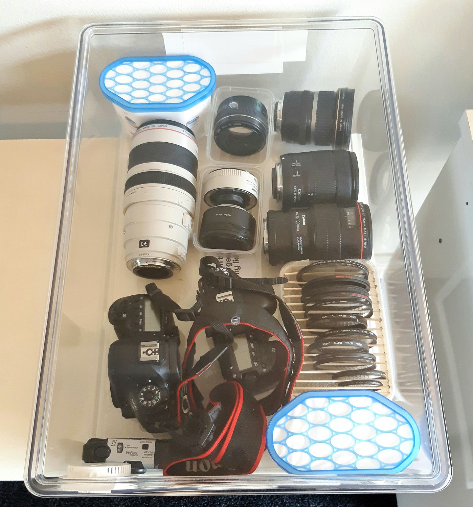

**Lens fungus** never occurred to me as a real thing, until it occurred in my camera gear.

## WTF is Lens Fungus?

What is lens fungus? It is a fungus, or mould, which grows on glass elements in cameras and lenses. A few months ago, I would not have believed it is a real, commonplace thing. You see, sometimes when browsing Facebook Marketplace for gear, I would find lens listings stating "lens in great condition, no scratches or fungus." "*Fungus*?" I would think, confused. What do they mean "fungus"? Mushrooms? Mould? Surely not. Has something been lost in translation from the conception to my viewing of this listing?

But then, the fungus struck me down.

## Fungal Foreword

I happened across a Marketplace listing for a nice lens I wanted. Unfortunately, the lens was included in a bundle, and the seller was unwilling to part with the lens by itself. Upon second glance, I noticed the price was quite good for what was included in the bundle: one camera body, three good lenses, and half a dozen accessories. Just over two thousand dollars for all of this... one of the lenses alone was worth a grand. This bundle was in fact a great trade deal! It was a bit more money than I wanted to spend, but I could take the lens I was after and sell the rest, probably for a small profit.

So, I met the buyer. I inspected the gear. I took a few test photos. The camera seemed to work fine, the lenses don't have any scratches. Funds and goods were exchanged. Brilliant!

## Spored Second Opinions

Later that night, I was taking in the haul of gear I had just scored. It was really quite a catch. The camera was full frame too, a potential upgrade from my current APS-C model.

And that is when I saw it. A tiny, weird-looking spot on my new favourite lens, which I hadn't noticed before buying:

I panicked. By sheer chance, earlier that day I had obliviously read about lens damage, with the mention of *fungus*. Suddenly, it all clicked. Was the unholy, gear-destroying fungus now happening to me?! That spot didn't look like normal, innocent dust.

If this was fungus, then by gods I was about to find it all and deal with it quick smart. Fungus is rumoured to spread between equipment stored together...

Looking inside the camera body, pure horror overcame me:

Fungus on the sensor! This was bad. Really, really bad. Fungus can produce acid, which eats away at delicate optical coatings. And sensor damage is a great way to turn a photographic device into a pricey paperweight.

Even while the situation could not get any better, a mould-searching mania continued over me, and I looked towards more items of the gear haul. In a final nail through my heart (and bank balance), a second lens was infected with the absolute motherload of fungus:

This patch appeared at least a few centimetres in diameter. Without a doubt, game over for this not-inexpensive lens.

## Disaster Analysis

It was suffice to say that my day was ruined. One camera and two lenses contaminated with fungus. What started out as a great deal turned out to be a load of mouldy, blighted rubbish. As a second hand purchase, I could not return the gear. I had no option but to pick up the pieces and move on.

The camera was definitely in bad shape. All images taken with it above around f/5 had a weird pattern in the lower right corner, as a result of the fungus:

With the fungus, the camera was near useless. No photographer who takes themselves even half seriously could use this camera in this state. It would have to be sold cents-on-the-dollar for parts.  
Unless... The sensor is easily accessible to clean, and sensor cleaning is a commonplace activity. If the fungus could theoretically be removed, then we'd be back in business. At the same time, by my reading the prognosis for camera fungus is poor - most folks say the damage is done even if the fungal threads can be detached.

In worse shape was the second lens with the huge patch of fungus. This was clearly deep inside the lens construction. Cleaning of such infection is not commonplace. Only someone who really knew their stuff could successfully deconstruct, clean, and reconstruct a lens. Probably another for the parts pile.

Desparately clinging onto any chance of salvation, I convinced myself the first lens (the one I actually wanted) was okay to be used with the small spot of fungus - or maybe, if you squint hard enough, it wasn't even fungus. It seemed like the spot did not affect the image quality.

## Mould Mitigation

A.K.A. Fungus Eradication Plan (FEP).

I wanted nothing to do with this new fungus discovery. Thus, I came up with a three part plan to rid myself of the curse:

1. Seek professional assistance for fungus-affected gear;
2. Clean all camera gear in my possession to eliminate any existing spores;
3. Implement protective measures to prevent future fungus outbreaks.

Priority: *critical*.  
Start time: *sunrise*.

-----------

The glorious dawn of the next day brought with it two allies in my fight against fungus: mould-destroying ultraviolet rays streaming from the sun, and camera store business hours.

All gear was to be cleaned, aired, and exposed to sunlight, where possible. You see, growth of mould requires high humidity, cool temperature, lack of light, and dust to eat\[1\]. I may not be able to easily control temperature, but you can bet on your grandmother's grave that I was about to enforce an iron fist of control on the humidity, light, and dust exposure of my gear. Any spores present were to be stopped in their tracks.

While lenses were relaxing out on the balcony (appropriately covered by transparent containers) and bags airing on racks, I went to my local camera store to seek cleaning help, where things got even more interesting.

## Cleaning Conundrum

"You've got some good gear," the friendly gentleman at the store told me. The positive tone didn't last long. "But I don't think I can help you. Try sending it to Canon, they will be able to do a proper evaluation."

His words confirmed my previous poor hopes for the fungus outlook. Canon might have the technology to clean the fungus... Or they might just tell me everything needs to be replaced, which surely isn't cheap. (Did I mention the sensor is one of the more expensive parts of a camera?) But it didn't look like I had much choice. Without cleaning, the gear is surely for parts. The last hope was now resting with Canon.

Canon's servicing process is in two parts. First, you send in the items to be evaluated, and a repair quote returned. Second, you may accept the quote and Canon takes your money. - I mean, fixes your items. In the closing hours of the day, I made my pilgrimage to Canon's doorstep and relinquished the gear. Now the wait was on.

-----------

A couple days and an eternity later, I received the holy text from Canon, in email form.

"FUNGUS - NOT CLEANABLE," remarked the evaluation, for both the camera and lenses. Rather blunt, if I might say.  
And what was the quote to repair? The parts required replacement, at the low, low cost of a kidney! I will not bother stating the real costs, for they will affront your eyes, but let me say that the gear could be replaced, second hand, for much less than Canon's request. I promptly declined the quote and requested return of my infected items.

On my return journey from Canon's service centre, I dropped in to my local camera store again. I told him the disappointment that had occurred. "Could you try cleaning the camera sensor anyway?" I pleaded. He once again told me that his cleaning was unlikely to be successful, especially given Canon's more advanced evaluation. My best bet was to sell the gear for parts at a good price.

## Defeat, Redemption

Defeated, I returned home, sold to the idea of pawning off the camera and lenses for what best price I could. To make a loss, not a "small profit" like I imagined a week earlier. Well, at least that one lens which I wanted is probably usable even with that tiny spot of fungus. Agh, but did I even want it now, marked by the plague which I had been caught by; a plague which cannot be wholly cleansed; a reminder of my naivety and suffering? Why do I even partake in photography, if all may be cast down by such a simple, yet devastating, condition? Perhaps I should sell everything and begin anew...

Amidst this despondency, a sudden idea came. The camera sensor was done for, apparently. If someone bought the camera for parts, the sensor would not be a part they could make use of. In this case, I may as well try cleaning the sensor myself. An experiment, you could say.

My curiosity was burning. A piece of lens cleaning cloth, taped to a wooden skewer and moistened with water, took shape in my hands. Camera on; menu; "sensor cleaning - clean manually." The sensor cap was unscrewed, revealing the shimmering sensor, whose surface was scourged by those small tendrils of fungus which had tormented me for the past week. Slowly, I lower the cloth contraption and gently made contact with the sensor. I remove the cloth.

The fungus is gone.

Feelings of elation and relief fill me. In the most incredible twist, against all the odds, the fungus came straight off, and beneath it the sensor is undamaged. Yes, despite all the sources online saying fungus is game over, despite the years of expertise of the camera store owner, despite the professional servicemanship of Canon, the problem literally just wiped off with a cloth and some water. I couldn't have been happier.

## Aftermath

As swift as they turned against me, the tides now moved in my favour on this fungus journey. I sent the camera back to the camera shop, owner in disbelief, to be cleaned properly, one last time. It works flawlessly to this day. The lens I desired, which started this all, was, surprisingly, sold, to a buyer who accepted the small imperfection in return for a slight discount. The other lens, overcome by fungus, was sold for about a quarter of its market price. All the other gear from the haul was in good condition, and will hopefully be sold soon. On the whole, I probably lost a fraction of what I paid. Given the worst outcome was avoided, I gained invaluable knowledge on lens fungus, and I have a great story to tell, I am quite content.

Part three of the Fungus Eradication Plan was recently completed, too. All my cameras and lenses now live in a clear, sealed tub with desiccant, a humidity sensor, and ample light.

Lens fungus will not be making a return to my life any time soon.

## Epilogue - Takeaways

This fungus ordeal has been an interesting one for me, because I went from zero to maximum knowledge on fungus in a very short period. Funny stories aside, there are some significant takeaways to be had.

### Identifying Fungus-Infected Gear

Firstly, how should one avoid buying camera gear with fungus? Well, once you know that lens fungus is a thing, it's not too hard.  
Thoroughly inspect lenses, looking for any weird patches on glass elements. Regular dust looks like tiny, near-invisible, circular dots. Anything else, especially spotty or branching patterns, could be fungus. Lenses can have many elements, so make sure to look deep into the lens, from both ends. Holding the lens up to a bright light and scanning through all focus and zoom levels is a good way to make any fungus visible.  
For cameras, find the setting to open the mirror/shutter, and carefully inspect the sensor. It can be useful to tilt the sensor around in light, to make any imperfections more apparent.  
If you are unsure whether any imperfections affect image quality, take photos of uniform objects (e.g. walls) at narrow apertures (f/10 and above). This will localise and maximise contrast of optical imperfections. Regular dust will appear as translucent dots - any other patterns may be fungus.

### Avoiding Fungal Growth

Now that you have camera gear, what do you do to avoid fungus growing? It's important to note that for most of us fungus spores are everywhere, and avoiding them is not feasible. Thus, the strategy is to prohibit fungus growth with proper storage. Lens fungus is a storage problem, not a contamination problem.  
According to Wikipedia\[1\], growth of lens fungus is encouraged by these conditions:

- Temperature between 10 and 35 degrees Celsius;
- Relative humidity >=70%;
- Darkness;
- Dust and other organic material.

Unless your house is on the surface of the sun, some of those conditions are probably true of the location you store your gear. You may want to invest thought into a storage solution to minimise the chance of fungus.  
I have heard that depriving the fungus of just one of the four conditions is satisfactory to prevent growth. The general consensus seems to be that humidity is the most effective and easiest factor to control. Commercial "dry boxes" which electronically control humidity are available. They aren't exactly cheap, so you can instead create your own with a sealed container and desiccant. If building your own, I'd recommend getting a humidity sensor to verify the humidity (I have seen claims that below 35% is bad also).

### Why Was the Fungus Cleanable?

The golden question you may be wondering: if everyone says fungus is the death penalty for camera optics, why was it completely cleanable in my case? My hypothesis is the fungus was new, and hadn't produced enough damaging acid yet. This theory is supported by the report of the gear seller that they were not aware of the fungus (possibly untrue, but also possibly true that they hadn't used the gear for a few months). Further, the camera store owner believes modern sensor technology may be more damage-resistant than previously.  
But then, why did Canon refuse to fix what was trivially fixable? Perhaps, using their state-of-the-art repair technology, they did find sensor damage, but on a scale too small to affect us mortal photographers. Or, maybe they have a blanket rule to not attempt cleaning on fungus due to some internal reasons. Or, if you're a cynic like me, Canon encourages service evaluations as "requires replacement" so they can charge the highest possible repair fee.

Either way, I do believe my case of fungus was a lucky one. Very easily could I have lost a lot more than I did. Don't risk your gear to lens fungus! Go protect it now!

## References

\[1\] "Lens fungus", https://en.wikipedia.org/wiki/Lens_fungus
